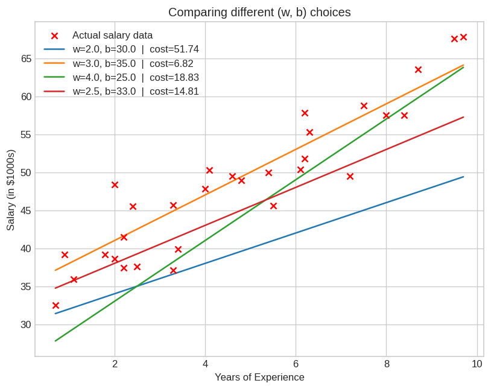

# 01 — Model Representation (Linear Regression with One Variable)

> Topic from: *Supervised Machine Learning: Regression and Classification*
> (DeepLearning.AI / Stanford Online, via Coursera)

## Concept

Linear regression with one variable models the relationship between a single
input feature `x` and a target `y` using:

```
f_w,b(x) = w*x + b
```

where `w` (weight) and `b` (bias) are parameters that determine the slope and
intercept of the line. Choosing different values of `w` and `b` produces
different lines — some fit the data well, some don't.

## The twist on this project

The course lab uses house size vs. price. This project applies the exact
same model to a different, independent dataset: **years of professional
experience vs. salary** (30 synthetic examples with realistic noise, see
`data.csv`).

## What's in this folder

| File | Description |
|---|---|
| `model.py` | From-scratch implementation of `f_w,b(x) = wx + b` and a Mean Squared Error cost function — no scikit-learn |
| `explore_model.ipynb` | Loads the data, tries several `(w, b)` pairs manually, compares them by cost, includes an interactive widget to explore the parameter space, and makes a prediction |
| `data.csv` | The years-of-experience vs. salary dataset |
| `raw_data.png`, `model_comparison.png` | Saved plots from the notebook |

## Results

Trying a few `(w, b)` candidates by hand shows how cost varies with the
parameters:



`w=3.0, b=35.0` gives the lowest cost (6.82) among the candidates tried —
but this was found by manual trial and error. That's the natural lead-in to
the next two topics:

- **Cost Function** — formalizes "how good is this fit?" into a single number
- **Gradient Descent** — automates the search for the `w, b` that minimizes it

## Running it

```bash
pip install numpy matplotlib pandas ipywidgets jupyter
jupyter notebook explore_model.ipynb
```

Or run `python model.py` for a quick non-interactive sanity check of the
model implementation.
