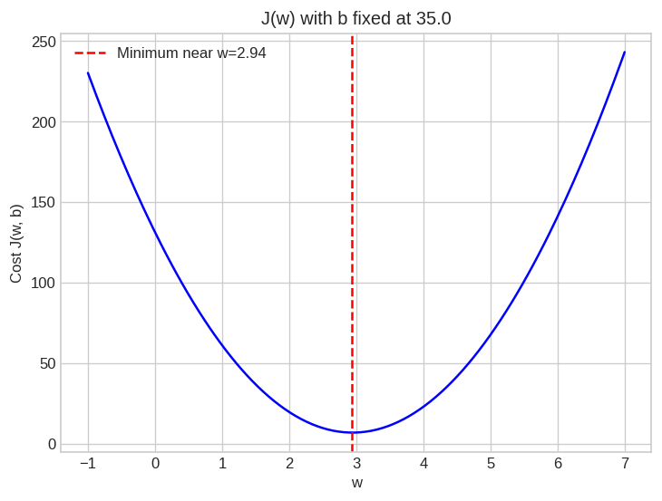
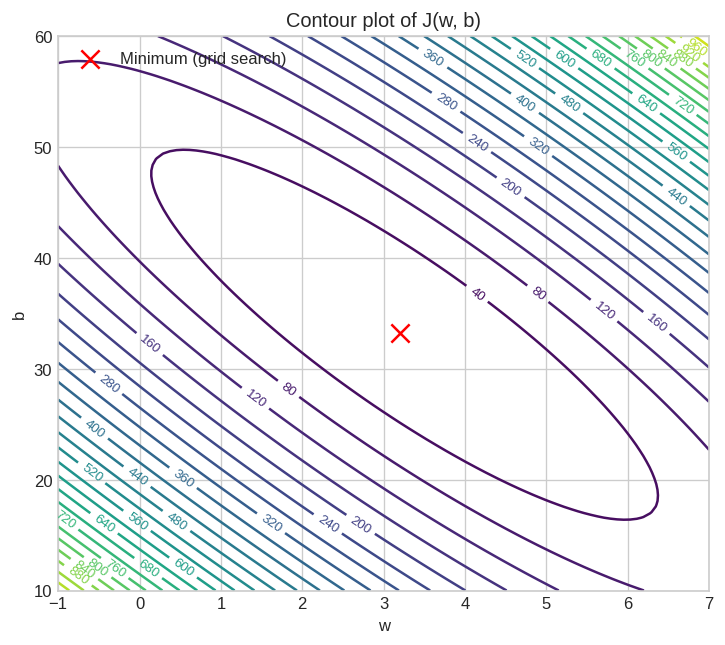
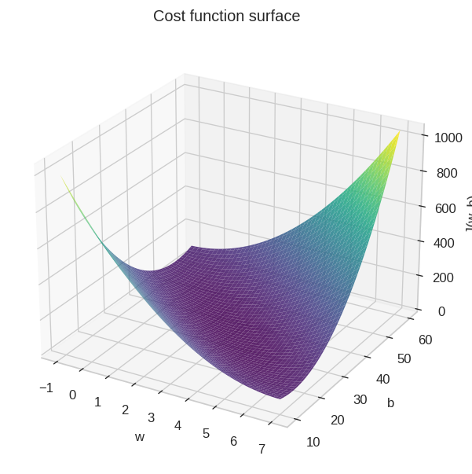

# 02 — Cost Function (Linear Regression with One Variable)

> Topic from: *Supervised Machine Learning: Regression and Classification*
> (DeepLearning.AI / Stanford Online, via Coursera)

## Concept

The cost function quantifies how well a given `(w, b)` fits the training
data:

```
J(w,b) = (1 / 2m) * sum_i ( f_w,b(x_i) - y_i )^2
```

Lower cost = better fit. This topic builds directly on **01 — Model
Representation**: instead of eyeballing which `(w, b)` looks best, we now
have a single number to compare any two choices.

## What's in this folder

| File | Description |
|---|---|
| `cost_function.py` | Vectorized `compute_cost(x, y, w, b)`, a grid-evaluation helper, and a brute-force `grid_search_minimum` |
| `explore_cost.ipynb` | Visualizes the cost three ways (1D slice, contour, 3D surface) and includes an interactive line-fit + contour explorer |
| `data.csv` | Same years-of-experience vs. salary dataset as topic 01, for continuity |

## Results

**Cost vs. w** (b held fixed) — a smooth, convex parabola:



**Contour plot of J(w, b)** — each ring is a set of (w, b) pairs with equal
cost; the center of the rings is the minimum:



**The same surface in 3D** — the "soup bowl" this lab is known for:



A brute-force grid search over `(w, b)` finds the minimum at roughly
`w=3.20, b=33.23` — close to the true `w=3.0, b=35.0` used to generate the
synthetic data. Grid search obviously doesn't scale to real problems with
many parameters, which is exactly the motivation for the next topic.

## Why this matters: setting up Gradient Descent

The cost surface here is convex (one smooth bowl, no local dips) — which
is precisely what makes **Gradient Descent** reliable for linear
regression: starting anywhere on this surface, you can always walk
downhill to the one global minimum.

## Running it

```bash
pip install numpy matplotlib pandas ipywidgets jupyter
jupyter notebook explore_cost.ipynb
```

Or run `python cost_function.py` for a quick non-interactive sanity check.
